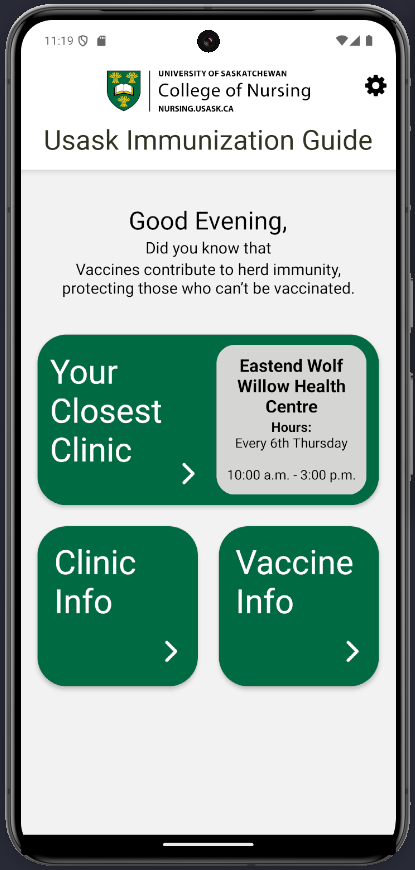
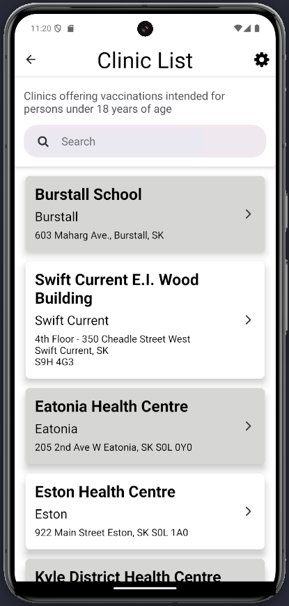
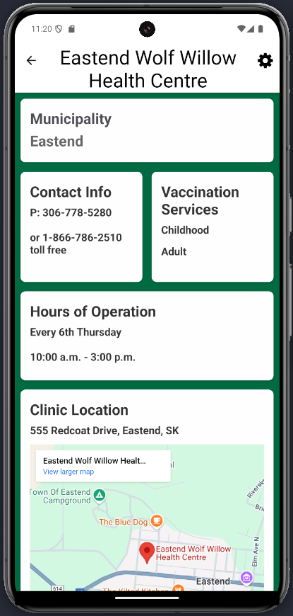

# USask Immunization Guide

## Overview

Working in collaboration with the College of Nursing, our project is dedicated to creating a mobile application that helps parents in Saskatchewan find information on their children’s immunizations and find nearby vaccine clinics. The app is built using React Native with Expo and is designed with ease-of-use in mind.

**Key Features:**
- **Clinic Locator:** View nearby clinic information and directions.
- **Vaccine Information:** Access detailed descriptions and trusted resources for each vaccine.
- **Future Enhancements:** Plans include appointment booking, immunization reminders, and secure storage of records.

### Context and Scope
- **Context:** Our app aims to simplify how parents access immunization details and clinic locations while ensuring that the information is up-to-date and reliable.
- **Scope:** Initially, the app will offer a map with clinic locations, vaccine details, and simple navigation. Future versions will expand to include additional interactive features.

### Screenshots
Below are a few early-stage screenshots of our application.  
*Note: These images are not the final design.*

| *Figure 1: Homepage displaying the main UI.* | *Figure 2: List of Saskatchewan clinics.* |
|----------------------------------------|--------------------------------------|
|  |  |

| *Figure 3: Clinic details page with information about a selected clinic.* | *Figure 4: The Clinic details page displays the location of the clinic.* |
|----------------------------------------|--------------------------------------|
|  |  |

| *Figure 5: Vaccine information page listing available vaccines and details.* | *Figure 6: Vaccine details page with the PDF info sheet about selected vaccine.*
|----------------------------------------|-------------------------------------|
|  | 


---

## Setup Guide

### Clone Repository
Run the following commands in a new directory:

```bash
git clone https://github.com/UniversityOfSaskatchewanCMPT371/term-project-2025-team-3.git
cd ./term-project-2025-team-3/sk-vaccine-app/
```

### Download Dependencies
Make sure you have [Node.js](https://nodejs.org) installed.

Run the following command in the `sk-vaccine-app` directory:

```bash
npm install
```

### Set Up Android Emulator
Follow the instructions for your operating system:
- [Android Studio Setup for Mac or Windows](https://docs.expo.dev/get-started/set-up-your-environment/?mode=development-build&platform=android&device=simulated#set-up-android-studio)

### Run Emulator  
Execute:
```bash
npx start --android
```

---

## Prototype Guide

When creating a prototype, please adhere to the following naming conventions:

| **Branch Name**   | **Folder Name**   |
|-------------------|-------------------|
| `proto_<test>`    | `proto_<folder>`  |

### Branch
- The branch name should start with `proto_` (e.g. `proto_server_request`). This signals to our post-checkout git hooks that a prototype branch is active so that no `proto_` directories are scrubbed.

### Folder
- Any new directories created at the project root should also start with `proto_` (e.g. `proto_server`).

### Why?
This convention helps prevent untracked files (like the `node_modules` folder) from persisting when switching branches. After switching, a post-checkout hook cleans up any `proto_` folders if the branch doesn’t match the naming pattern.

### Prototype FAQ
**Q:** My prototype won’t run after switching back.  
**A:** When switching to a prototype branch, you must run `npm install` (or `npm i`) again. For temporary testing, you can rename your prototype folder to remove the `proto_` prefix—but remember to revert the name before pushing your changes.

---

## Team Overview
## Project Manager
Trushank Lakdawala <brk>

**The project manager** is in charge of communicating with the stakeholder. They set up the meetings and need a clear understanding of the wants and needs of the stakeholder. This person also assigns tasks, roles and books any meetings within the group as needed. They also ensure the project is kept on track by asking for updates and communicating with group members. Within the group they provide clarity about any questions and make sure everyone feels comfortable with their role and tasks. Lastly they also create the supplemental documents needed for the deliverables to be done.

## Developer Lead
 Conner Hnatiuk <brk>

**The developer lead** is in charge of communicating with the developers and their job is to plan out tasks required for the completion of the sprint. They also take ownership of the document of progress, acitvites and unit tests. Chooses the tech stack, and communicates with the test lead and project manager often to keep track of progress. 

## Test Lead 
 Udhav Walia <brk>

**The test lead** is in charge of test-related matters. They ensure that test plans are created and put in place, they choose the test stack and have a proper understanding of how the program should be tested


## Risk Manager
 Alex Friesen <brk>

**The risk manager** is in charge of proactive risk scanning. They update the "Top 10 Risks" document often adding in new concerns about risk from team members and from assessing risk exposure.

## Developer/Tester
| Marziyeh Hassani Sangani | Nan Shan | Alex Friesen |

**The developers/testers** are in charge of completing the tasks assigned to them via Jira or GitHub. They ensure unit tests are written for their program and constant communciation is kept from them and their respective leaders.

---

*For more detailed information, testing notes, and future planning, please refer to our project wiki.*